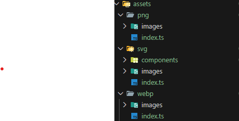
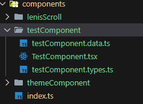
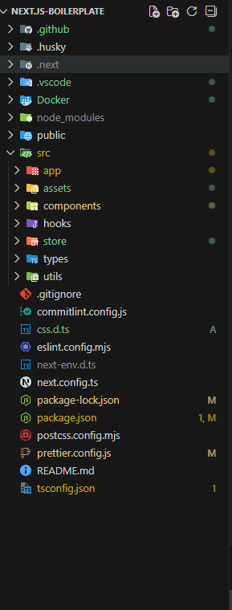

# Next.js Enterprise Boilerplate

Modern, scalable and production-ready **Next.js 16 boilerplate** built with:

- TypeScript
- Tailwind CSS v4 (Design Token Architecture)
- Redux Toolkit
- next-themes
- Lenis Smooth Scroll
- Husky + Commitlint
- ESLint + Prettier (Strict Rules)
- Docker + Docker Compose
- CI/CD GitHub Workflows

---

## Table of Contents

- [Introduction](#introduction)
- [Getting Started](#getting-started)
- [Project Structure](#project-structure)
- [Tech Stack & Libraries](#tech-stack--libraries)
- [How It Works](#how-it-works)
- [Docker Setup](#docker-setup)
- [Linting & Code Quality](#linting--code-quality)
- [CI/CD Workflows](#cicd-workflows)
- [Environment Variables](#environment-variables)
- [Screenshots](#screenshots)

---

## Introduction

This boilerplate is designed for scalable frontend applications using modern architecture and enterprise-level best practices.

It includes:

- Design Token based Tailwind system
- Dark / Light theme support
- Strict ESLint rules
- Pre-configured Redux Toolkit
- Production-ready folder structure
- Dockerized environment
- GitHub CI/CD automation

---

## Getting Started

### 1️⃣ Install Dependencies

```bash
npm install
```

### 2️⃣ Run Dev Server

```bash
npm run dev
```

App will run at:

```
http://localhost:3000
```

---

## Project Structure

```
.github/              //GitHub configuration (CI/CD automation & workflows)
 └── workflows/       //GitHub Actions pipelines
     ├── ci.yml       //Continuous Integration (lint, build, checks)
     ├── deploy.yml   //Deployment workflow (auto deploy setup)
     ├── release.yml  //Automated versioning & release pipeline

Docker/               //Containerization setup for development & production
 ├── Dockerfile       //Production-ready container configuration
 ├── docker-compose.yml //Multi-container orchestration setup
 ├── .dockerignore    //Files excluded from Docker build context

src/                  //Main application source code
 ├── app/             //Next.js App Router (layouts, pages, providers)
 ├── assets/          //Static assets (png, svg, webp, icons)
 ├── components/      //Feature-based scalable component architecture
 ├── hooks/           //Reusable custom React hooks
 ├── store/           //Redux Toolkit store setup (RTK Query recommended for auth)
 ├── types/           //Global TypeScript types & interfaces
 ├── utils/           //Utility functions & helper modules

commitlint.config.js  //Conventional commit rules configuration
css.d.ts              //Global CSS module type declarations
eslint.config.mjs     //ESLint configuration (strict enterprise rules)
prettier.config.js    //Prettier code formatting configuration

### Folder Structure Preview

```

---

## Tech Stack & Libraries

| Technology      | Purpose                 |
| --------------- | ----------------------- |
| Next.js 16      | App Router architecture |
| TypeScript      | Type safety             |
| Tailwind CSS v4 | Utility-first styling   |
| Redux Toolkit   | State management        |
| next-themes     | Theme management        |
| Lenis           | Smooth scrolling        |
| Husky           | Git hooks               |
| Commitlint      | Conventional commits    |
| ESLint          | Code linting            |
| Prettier        | Code formatting         |
| Docker          | Containerization        |

---

## How It Works

### Design Tokens

Global CSS uses semantic design tokens:

```css
--color-background
--color-foreground-primary
--text-heading-lg
```

Tailwind maps these via:

```css
@theme inline;
```

Usage:

```tsx
<h1 className="text-foreground-primary text-heading-lg">
```

---

### Theme Switching

Using `next-themes` with:

```tsx
<ThemeProvider attribute="data-theme">
```

Theme is controlled via:

```
data-theme="dark"
data-theme="light"
```

---

### State Management

Redux Toolkit setup in:

```
src/store/
```

Includes:

- Typed hooks
- Central store config
- Slice architecture

---

## Docker Setup

### Build & Run

```bash
docker-compose up --build
```

Production-ready container defined in:

```
Docker/Dockerfile
```

---

## Linting & Code Quality

Run lint:

```bash
npm run lint
```

Pre-commit hooks:

- ESLint
- Prettier
- Commitlint

Conventional commit example:

```
feat: add new button component
fix: resolve theme hydration issue
```

---

## CI/CD Workflows

Located in:

```
.github/workflows/
```

Includes:

- ci.yml → Lint + Build check
- deploy.yml → Deployment pipeline
- release.yml → Version tagging

---

## Environment Variables

Copy:

```
.env.example
```

to:

```
.env
```

Add your environment-specific configs.

---

## Screenshots




### App Preview



---

## Author

Muhammad Shayan Bukhari  
Frontend Developer

---

## License

MIT
